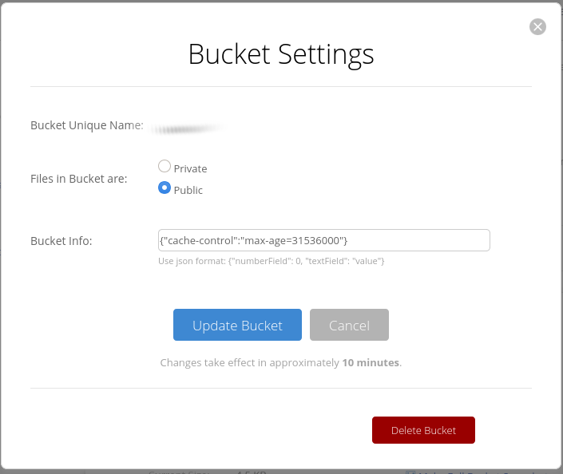
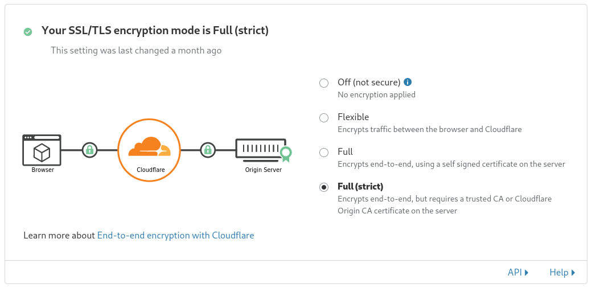

# Overview
This is a [storage adapter](https://ghost.org/docs/concepts/storage-adapters/) for use with Ghost. It serves images over a public Backblaze B2 bucket to offload image asset serving from the Ghost Node.js application. It is best used in conjunction with Cloudflare. Cloudflare accelerates image loading via CDN caching and completely B2 bandwidth charges thanks to the [Bandwidth Alliance](https://www.cloudflare.com/bandwidth-alliance/).

# Docker
If you run your Ghost in the [official community Docker image](), you can use this adapter by updating your base image to be [pubbit/ghost:$VERSION-b2]() instead. 

# Installation
You can install via fetching the package via Git or NPM and running `npm install` within the package directory. 

## NPM
```
# from the root of the Ghost installation
mkdir -p content/adapters/storage/b2
cd content/adapters/storage/b2
npm view ghost-storage-b2 dist.tarball | xargs curl -s | tar -xz --strip-components 1
npm install
```

## Git
```
# from the root of the Ghost installation
sudo mkdir -p content/adapters/storage
cd content/adapters/storage
git clone https://github.com/gnalck/ghost-storage-b2.git b2
cd b2 && npm install
```

# Configuration
After installation, you will need to update your `production.config.json` to have the required parameters. If using Docker, you can instead pass along the parameters as [environmental variables](https://ghost.org/docs/concepts/config/#running-ghost-with-config-env-variables) instead, to avoid needing to further modify your image.

```
  "storage": {
    "active": "b2",
    "b2": {
      "applicationKeyId": "xxxxxxxxxxxx",
      "applicationKey": "xxxxxxxxxxxxxxxxxxxxxxxxxxxxxxxxxxxxxxxxxx",
      "bucketId": "xxxxxxxxxxxxxxxxxxxxxxxx",
      "bucketName": "your-bucket",
      "host": "https://images.your-project.com",
      "pathPrefix": "optionalPath/" 
    }
  }
```

### applicationKeyId
The identifier of your secret key.

### applicationKey
The secret key for authorizing communication with Backblaze B2.

### bucketId
The id of the bucket in Backblaze B2. Needed for communication with B2.

### bucketName
The friendly-name of your bucket in Backblaze B2. Used to build up the public-facing URL we return from the storage adapter.

### host
This should point at either your public Backblaze bucket (`fXXX.backblazeb2.com`) or your CNAME'd Cloudflare-proxying hostname that points to your public Backblaze bucket.

### pathPrefix
This is an optional prefix to prepend to the path that images are saved in. Images by default are saved at the root of your bucket, you can use this to further nest your save path.

# External Configuration
## Backblaze
To find the root domain of your Backblaze bucket, you need to upload an arbitrary file to it and then navigate to the file details. The bucket name will show up as `fXXX.backblazeb2.com`.

<details>
<summary>screenshot</summary>


</details>

You will either need to use that as your `host` in the config settings, or set up Cloudflare to proxy to that domain (see below).

### Increase TTL (optional)
Ghost does not overwrite image assets. You can leverage this to set your Cache TTL to be arbitrarily long, with the knowledge that the data will never be "stale".

To increase the TTL to, e.g., 1 year, paste `{"cache-control":"max-age=31536000"}` into your `Bucket Settings`

<details>
<summary>screenshot</summary>


</details>

## Cloudflare (optional)
Using the bucket hostname you got above, you can set up Cloudflare to proxy a domain you own to your bucket.

### DNS
In the example below, we point `images.myproject.com` to `f000.backblazeb2.com`. Make sure the record is proxied (the cloud is orange).

<details>
<summary>screenshot</summary>


</details>

### SSL
You will want to enable Full/Strict SSL as well. Otherwise you may encounter an infinite redirect issue.

<details>
<summary>screenshot</summary>


</details>

# Credits
Thanks to [anazhd](https://github.com/anazhd/) for helping with the README!
